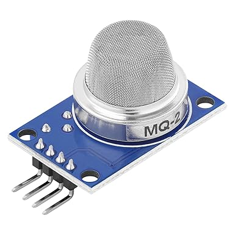

      Descrizione: AZDelivery MQ-2 Modulo Sensore di Gas, Fumo e Qualità dell'Aria compatibile con Arduino incluso un E-Book!

  Prezzo: 7,29 €
      https://www.amazon.it/AZDelivery-Sensore-qualit%C3%A0-modulo-Arduino/dp/B07CYYB82F/ref=sr_1_1?crid=32B555BJU7WJA&dib=eyJ2IjoiMSJ9.4bCnUPsQeEULcXspC2HqvctT1idZU3hOUrbJd96M8UzLmQaupYxkM6GfY7x9w5oHxIEx2ofkaHG-F94TLQ8dtreeb6Z8x5gvWc3cMyZ857fKR85Kf5MnaKWHPYOXB_JWknACoRfccpH87OX4meZM2XzvruHIVVzg02YcCOghCQ6NpUnwqQmo9UlJ6JecdFKD2etSKy--A5_Nv9UIU-yEFIhrvji7AhCV9uDYGsJDGRcg29SPx_sYTQGKLMtnu8ZXCeIo-oamg79W7rBJrZsBiuLHivYwDlWzAQb_BRQ82TA.KGVds6I_NDTm3skaquUp7qNS2K1glQuAwj6yZmSok-g&dib_tag=se&keywords=azdelivery%2Bmq-2%2Bmodulo%2Bsensore%2Bdi%2Bgas%2C%2Bfumo%2Be%2Bqualit%C3%A0%2Bdell%27aria%2Bcompatibile%2Bcon%2Barduino%2Bincluso%2Bun%2Be-book!%2Bcosto%3A%2B7%2C29%2B%E2%82%AC
-----
BESTonZON 2 Pezzi Di Gioco Interattivo Buzzer Risposta Gioco Pulsante Di Risposta In Classe Oggetti Di Scena Per Quiz In Classe
costo: 16,59 €
https://www.amazon.it/BESTonZON-Interattivo-Risposta-Pulsante-Oggetti/dp/B0FX1485SQ/ref=sr_1_1?__mk_it_IT=%C3%85M%C3%85%C5%BD%C3%95%C3%91&crid=2BF25P2UVQAM6&dib=eyJ2IjoiMSJ9.KDxrc4SArjmSeCqHG-PxqBWs7YyZcEKa4TPKFHsRmFks-MaZYZH0lpeQxYdMEK07HN8kdQu5TiSamJjVrbqIhzIAwIHSN4WF3NR2lgbCi-rXwKHBeIlnxWPKbJPVTQGr9EG0Q7NDKsoDXWddNI8vK1I7ZVZwlJbFVsL27GwWWi2NMdQL_dzmTpXr0mcadflowWcCIzQ4Y_zVk1mP3OsoQB6sYM2nB3wMH5lMZtOgkwQE2V-FDueAApwoJX7E0uPpIuXOkImxTa7XGRnqBx_EafRfczHV4uIj8OSz9nG5htw.k4d85EnNXSzoAP91CqazbNZKFuJSm7NiI_lZ-vFWd-w&dib_tag=se&keywords=BESTonZON+2+Pezzi+Di+Gioco+Interattivo+Buzzer+Risposta+Gioco+Pulsante+Di+Risposta+In+Classe+Oggetti+Di+Scena+Per+Quiz+In+Classe&qid=1773829017&sprefix=bestonzon+2+pezzi+di+gioco+interattivo+buzzer+risposta+gioco+pulsante+di+risposta+in+classe+oggetti+di+scena+per+quiz+in+classe%2Caps%2C232&sr=8-1
-----
Motore DC 775 Motore DC 12 V Motore CC ad alta coppia Motore CC Max 20000 RPM Cuscinetti a sfera Dual Ball Ruote di potenza silenziosa Aggiornamento motore DC Motore (con staffa)
COSTO: 16,14 €
https://www.amazon.it/sspa/click?ie=UTF8&spc=MTo2ODYwMzMxOTk4MjM2OTg4OjE3NzM3NTQwNDI6c3BfYXRmOjMwMDgzNzc4MzU0MjgzMjo6MDo6&url=%2FMotore-Cuscinetti-potenza-silenziosa-Aggiornamento%2Fdp%2FB0BW73N4VN%2Fref%3Dsr_1_1_sspa%3F__mk_it_IT%3D%25C3%2585M%25C3%2585%25C5%25BD%25C3%2595%25C3%2591%26crid%3D1SMIPDFLAWRV9%26dib%3DeyJ2IjoiMSJ9.uCl78n_fB9W_x2ibQhqbMgd7ljkz_rpv5_n92HHWhvK6NSjr-1tRv67xm1esuxcPgRp2gU1K-gnVrpLo7MwWkojq_a1nogMFcVLGoSAxuCjpnPDshRBrG85VlKyPRMw4vzE_C5pqfFvSzxqM2SNTnbhDVrv07nQYhzp9iHgrDYUCvVQyJrzGuRjsywndjG51ovnSW0bVTt59LA_Q6hnzWT--2VwvIx9XJnLAfiGVnA7nDowcy3JaXuGZGxy6XSgpdmVZhJuemGdhf6DUtw3Yz8UgJU7vxsMCFQ4zhz1vLU4.kkNvWKmhVe_SOXZhNK_Yf23DHFT0kvBftHWh_sf7frk%26dib_tag%3Dse%26keywords%3Dmotore%2Bdc%26qid%3D1773754041%26sprefix%3Dmotori%2Bd%252Caps%252C247%26sr%3D8-1-spons%26aref%3D6hh8Wz9RsC%26sp_csd%3Dd2lkZ2V0TmFtZT1zcF9hdGY%26psc%3D1&aref=6hh8Wz9RsC&sp_cr=ZAZ 
-----
Power Bank 24000mAh con 3 Uscite e 2 Ingressi Ricarica Rapida 22.5W Caricabatterie Portatile con USB C,Carica Batterie Portatile per Cellulare con Torcia, Powerbank Potente per iphone,Xiaomi,Samsung
costo: 16,99 € 
https://www.amazon.it/24000mAh-Caricabatterie-Portatile-Cellulare-Powerbank/dp/B09PYK6ZHC/ref=sr_1_16?__mk_it_IT=%C3%85M%C3%85%C5%BD%C3%95%C3%91&dib=eyJ2IjoiMSJ9.6c_Ku2KMrDMuGRB8HMQua0aTPtGZYBZ3-hS916JLOzCwnJG-m_SHXinNcAtsqK_3syV9jQDmjia1HUC7tFrv0WGc3TQfh-EUyuUtO9xutRB-TpKMbJ10LbFl7hv_lp_zLRkhWNSxZzy6cxRUBgWHmwMxe7S3UgWV-trqJ5ltqfiH70q5VlKdKESLlTWthMDFOBJgVo5vbAGaM-gQU9qA15SLBJ6VvRZvksGqdQk9H02rBQ_r-TvlkdEK8ArIiuGY7ZekuFebixhCoeA69QeZkl0SX2Y5MVDbuW7Np1HxlV8.w4Nh9QJnuRzmrJCUEW9aFGKqt4i1n8751MxXN-NLLto&dib_tag=se&keywords=Batteria+esterna+%28Power+Bank+o+pacco+batterie%29&qid=1773828727&sr=8-16
------
Arduino UNO Rev3 [A000066] - Scheda di sviluppo versatile con microcontrollore ATmega328P, compatibile con Arduino IDE, ideale per principianti e progetti di elettronica, robotica e fai da te
costo: 28,85 €
https://www.amazon.it/Arduino-Uno-Rev3-Scheda-microcontrollore/dp/B008GRTSV6/ref=sr_1_6?__mk_it_IT=%C3%85M%C3%85%C5%BD%C3%95%C3%91&crid=3VQ40NI722WLH&dib=eyJ2IjoiMSJ9.yuI0D2fsClu2DF7NuAqBKpJvQPJkVVNfgswUIgSLekcbL6p_exM6oh6wR8u1Wb-XgMRcOyp6FbOCXYXEhPD6yOGkUY_XnNV_bW6LAGS8cjhdVXvTJyDQPN4ANQH50UiQ36JTXJWk0HYBZCZ2dA7ZeFzwl8W6TMdaGojYH_NATLs_hL0zs1vW5lZ6oZygRN8febddmtoED94NZ1VJJJAe47TjkfxN5U_NXF7ruORD8BqzWuIIxLXz9PFnVLN8vmj5hvq0f5UzHl5KiKlxmKxkQtwnPAaxJmRlBs2TMT0nwW8.xi67KVsdtv74k3a2vhNFAtpTprfD4UA6huMGOGOIJ8Y&dib_tag=se&keywords=Arduino+Uno+%28oppure+Arduino+Nano%29&qid=1773829327&sprefix=arduino+uno+oppure+arduino+nano+%2Caps%2C297&sr=8-6
-----
sciuU Porta Batterie per 12 Pile AA & 16 Pile AAA - Supporto da Parete - Contenitore Organizzazione da Tavolo o da Muro
costo: 11,99 €
https://www.amazon.it/sciuU-Porta-Batterie-Pile-Organizzazione/dp/B0D542FN51/ref=sr_1_7?__mk_it_IT=%C3%85M%C3%85%C5%BD%C3%95%C3%91&crid=YBNVIZXTTZZH&dib=eyJ2IjoiMSJ9.r2-8ytRtx6IyHB_4xI4SOG_fvb7nz3ONJMetyOoQks11f2mOi-Lp7tSnJqeXUxx09ot-CquM2Kh71ns7sk_b89ysG8VcDi9uAIn0e-k399twpIPEhxFDEq22gBBTXVaPS6Vy5bcJNZHNBoBPl28PfqicvIJ7FaVeZDQKZtDx0zJUwd7VQrvRo5XbqFkc_CnzMBZoZqZk4ehT4kUBYJjUB2dJbKgS2relieHCjsUL3B25sxtGraCEeRh_JlSrsycNOrNG2cQEaEdWhAHFQTfTufK5W0vaZ9JevspDoywK8JA.Fsh_GQcQNjz8G42wQxsjHgnRhI9cRQVWs6fMXjnYPf4&dib_tag=se&keywords=Portabatterie&qid=1773829518&sprefix=portabatterie%2Caps%2C261&sr=8-7

